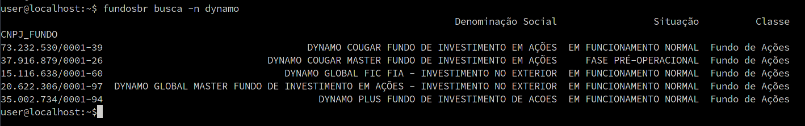
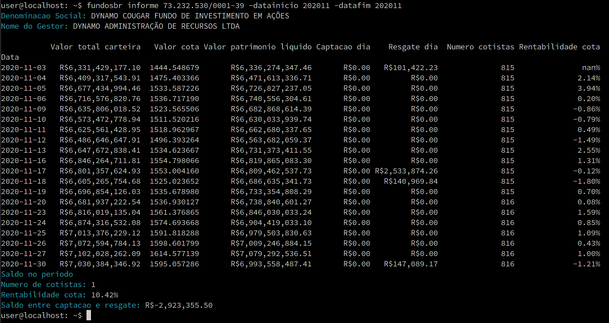

# fundosbr - Mostra informações sobre fundos de investimentos brasileiros


[](https://codecov.io/gh/thobiast/fundosbr)
[](https://github.com/thobiast/fundosbr/blob/main/LICENSE)
[](https://github.com/psf/black)

Script que baixa informações direto do site da CVM e mostra detalhes dos fundos de investimento.

## Instalação

```bash
pip install fundosbr
```

Os arquivos _csv_ baixados do site da CVM são armazenados no diretório _/tmp/fundosbr\_dados_.
Se quiser alterar, edite o arquivo "_fundosbr.py_" e modifique a variável "_CSV\_FILES\_DIR_".

## Ajuda

```bash
user@localhost: ~$ fundosbr
usage: fundosbr [-h] [-d] {busca,informe,compara,rank} ...

Informacoes sobre fundos de investimentos

optional arguments:
  -h, --help            show this help message and exit
  -d, --debug           debug flag

Comandos:
  {busca,informe,compara,rank}
    busca               Busca fundo
    informe             Informes fundo
    compara             Comparas fundos
    rank                Rank fundos

    Example of use:
        fundosbr busca -h
        fundosbr busca -n verde
        fundosbr busca -c 22.187.946/0001-41
        fundosbr busca -n "ip participa" -t acoes
        fundosbr informe -h
        fundosbr informe 73.232.530/0001-39 -datainicio 202011 -datafim 202012
```

```bash
user@localhost: ~$ fundosbr informe -h
usage: fundosbr informe [-h] [-datainicio DATAINICIO] [-datafim DATAFIM] [-m] cnpj

positional arguments:
  cnpj                  CNPJ do fundo

optional arguments:
  -h, --help            show this help message and exit
  -datainicio DATAINICIO
                        Data inicio (YYYYMM)
  -datafim DATAFIM      Data fim (YYYYMM)
  -m, --mensal          Mostra estatistica mensal

```

```bash
user@localhost: ~$ fundosbr compara -h
usage: fundosbr compara [-h] [-datainicio DATAINICIO] [-datafim DATAFIM] [-m] cnpj

positional arguments:
  cnpj                  CNPJ do fundo

optional arguments:
  -h, --help            show this help message and exit
  -datainicio DATAINICIO
                        Data inicio (YYYYMM)
  -datafim DATAFIM      Data fim (YYYYMM)
  -m, --mensal          Mostra estatistica mensal
```

## Exemplo de uso:

Procura um fundo pelo nome:



Mostra os informes de um fundo:


